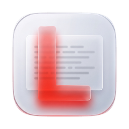

<div align="center">



# LogDeck Desktop

**A desktop log reader for the Laravel projects on your own machine.**

[](https://github.com/aravindpanicker/logdeck-desktop/actions/workflows/ci.yml)
[](LICENSE)

[**Website and downloads →**](https://aravindpanicker.github.io/logdeck-desktop/)

</div>

---

Tailing `storage/logs/` in a terminal makes it hard to see where one event ends
and the next begins, and harder still to lift a whole stack trace out cleanly.
LogDeck registers your project folders, watches all of them at once, and renders
each log event as a single unit you can filter, search, and copy whole.

## What it does

- **Entries, not lines.** A header plus its JSON context and every stack frame
  beneath it is one thing on screen — and one thing on your clipboard. Copy a
  47-frame trace with one click and paste it into a bug report intact.
- **Live tailing without polling from JS.** A Rust thread per project reads
  incrementally from a stored byte offset every 300 ms. New entries appear with
  no interaction.
- **Rotation and `log:clear` are survivable.** When the source rotates or gets
  truncated, LogDeck inserts a visible **break** and keeps everything above it.
  What you were reading does not vanish because the file did.
- **Every project is watched, one is retained.** Unselected projects accumulate
  an activity badge — a count and the highest level seen — without holding any
  log text in memory. Select one and its stream is what you read.
- **Search that reaches into traces.** Matching runs against the raw entry, so a
  hit inside collapsed context expands the entry, annotates the match count, and
  highlights the hits.
- **Level filtering** from `DEBUG` to `EMERGENCY`, with severity carried as a
  coloured rail down the gutter rather than a badge competing with the message.
- **Pin a file.** By default the target is the newest file in the logs
  directory, followed across rotation. Pin a specific one and it still streams —
  pinning stops following rotation, not tailing.
- **Both channels.** `single` writes `laravel.log`, `daily` writes
  `laravel-YYYY-MM-DD.log`. LogDeck resolves the directory, not a filename, so
  either works, as does a project with both.
- **Offline is temporary.** Move a project folder away and it goes offline with
  a reason, backing off from 300 ms toward 5 s, and reattaches by itself when
  the path returns. Removal stays a deliberate action.

Registering a folder **warns but never blocks**: a folder with no
`storage/logs/` is still added, shown inert with the reason why.

## Install

Download a build for your platform from
[Releases](https://github.com/aravindpanicker/logdeck-desktop/releases) —
macOS (universal), Windows and Linux — or build from source below.

**The builds are unsigned.** macOS will refuse the first launch with
"unidentified developer": right-click the app and choose *Open*, or clear the
quarantine flag with
`xattr -dr com.apple.quarantine "/Applications/LogDeck Desktop.app"`. Windows
shows a SmartScreen warning behind *More info → Run anyway*. Signing both
platforms needs paid certificates.

## Build from source

**Prerequisites**

- [Rust](https://rustup.rs) (stable) and the
  [Tauri v2 system dependencies](https://tauri.app/start/prerequisites/) for
  your platform
- Node.js 24 LTS. The version is pinned in `.nvmrc`, so `nvm use` picks it up,
  and CI reads the same file.

```bash
git clone https://github.com/aravindpanicker/logdeck-desktop.git
cd logdeck-desktop
npm install
npm run tauri dev      # run the app
npm run tauri build    # produce a bundle for the current platform
```

`npm run dev` starts Vite alone in a browser — useful for styling, but every
`invoke()` call fails there, so the log stream will not work.

## Architecture

Two processes, one repo.

| | |
|---|---|
| **`src/`** | React 19 + TypeScript on Vite, fixed port 1420. Renders the session record, owns filtering and search. |
| **`src-tauri/`** | Rust. Owns the project registry, the watcher threads, and all file access. `main.rs` is a thin binary calling `run()` in `lib.rs`. |

Three decisions shape everything else:

**The view is a session record, not a file mirror.** What you see is what has
been observed since you selected the project, spanning any number of breaks —
capped at the newest 2000 entries, with older ones paged back on demand. It is
deliberately not a reflection of what the file currently contains.

**All projects are watched; only the selected one is retained.** Background
watchers parse deltas into activity counts and discard the text, which is what
bounds memory with many projects registered.

**File access goes through our own Rust commands.** The `fs` plugin's scopes are
fixed at compile time, but project paths are chosen at runtime, so it is
deliberately unused. The capability allowlist is `dialog` and
`clipboard-manager:allow-write-text` — nothing else.

A few terms are used precisely throughout the code, and are worth knowing before
reading it:

| Term | Means |
|---|---|
| **Entry** | One logical log event — a header with its context and stack frames. The unit of copying, filtering, searching and counting. |
| **Line** | One physical line of a file. A storage detail, never something the user acts on. |
| **Break** | A point where the underlying source discontinued, by rotation or truncation. Entries either side of it are unrelated in time. |
| **Session Record** | What is retained for a project since it was selected, spanning any number of breaks. Bounded at 2000 entries, not total. |
| **Project** | A registered folder, identified by its absolute path. Registered by intent, not by validity. |
| **Target** | The single file currently being read within a project — newest by default, or one you have pinned. |

## Development

```bash
npm test                      # Vitest
npm run build                 # tsc typecheck + Vite build
cd src-tauri && cargo test    # Rust unit tests + the verification matrix
cd src-tauri && cargo clippy  # lints
```

A scenario matrix lives in `src-tauri/src/verification.rs` as `row_01`…`row_10`,
driving the real watcher and registry against real files in a self-deleting temp
directory — appending an entry, truncating the file, dropping in a newer dated
one, moving a project folder away and back, restarting. Each test is named for
the behaviour it protects.

### Releasing

Merging to `main` publishes a release automatically — but only when the PR bumps
the version. `.github/workflows/release.yml` compares `version` in
`src-tauri/tauri.conf.json` against the previous commit; unchanged means no
release, so docs-only merges are free. The same version must appear in
`package.json` and `src-tauri/Cargo.toml` or the run fails rather than shipping a
bundle labelled differently from its tag. A matching build then runs on macOS
(Apple Silicon and Intel), Windows and Ubuntu 22.04, and all the installers land
on one tagged release.

**What CI cannot cover**, and is checked by hand instead: the native folder
dialog, reading the system clipboard back after a copy, a real WebView boot
(CSP violations included), and anything measured in pixels — jsdom has no
layout engine, so scroll arithmetic is tested as arithmetic in
`scrollAnchor.ts` and confirmed on screen by a human. There is no
`tauri-driver` E2E layer; nothing exercises the IPC boundary end to end. That
gap is deferred, not dismissed.

## License

MIT — see [LICENSE](LICENSE).
